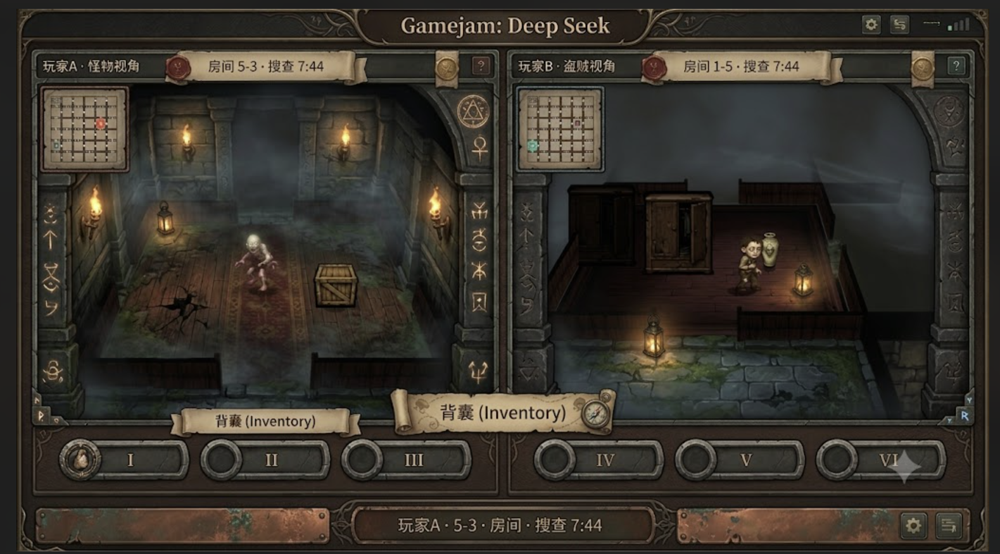
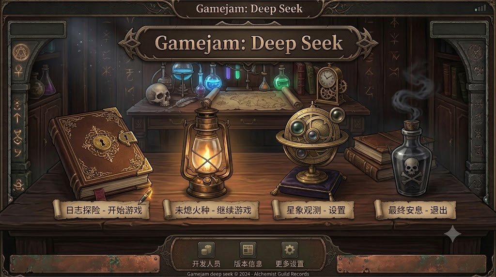
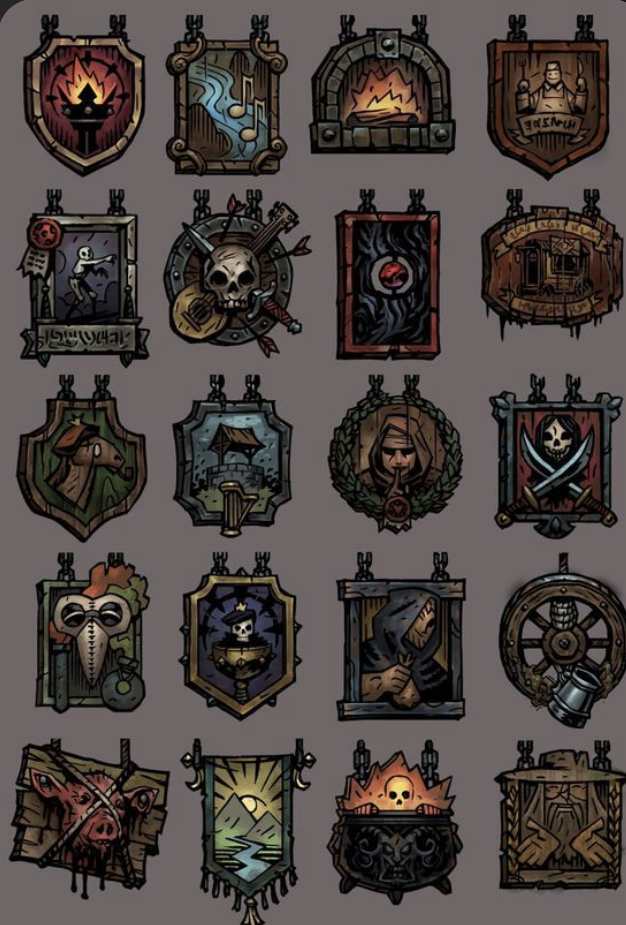

有几个问题：
1.两个房间之间门的连接需要连续，也就是房间之间是紧贴着的，目前我看到了两个门室友之间有明显的沟壑。
2.当角色在房间里面的时候，周围的房间都应该不显示，呈现黑色，只有当前房间内显示。
3.目前的房间太小了，至少应该是现在的两倍才对。
4.速度变成现在的两倍。
5.支持转动视角，比如按qe是逆时针顺时针转动45度。

现在要加几个东西：
1.存藏品逻辑，现在藏品不采取掩藏，而是直接放在家具内部，现在每个储物家具都可以交互。所有家具都是通过撞击的方式打开或者损毁，撞击需要对应的按钮，往某个方向向前撞击，对于怪物只需要撞击一次打开，然后放入藏品，也可以取出。但是玩家需要撞击直到到达损毁度才能取出里面的藏品。
2.其次，其他家具内部会有小玩意儿，价值不如藏品，但是依然算作价值，是有概率刷出，概率设置为50%。
3.所有财物都需要带出去才能生效，当前仅能撤离一次。
4。存有藏品的家具，会根据家具价值的大小采取不同程度的左右晃动，以表示其中有高价值物品。

1.音效（走路，攻击，碰撞，打开家具，拾取藏品）
2.动效（撞击动画，箱子碎掉动画，箱子抖动动画，受击动画，打击感）
3.藏品面板UI
4.扩展玩法：
-
6.房间周围的布局看是用轮廓还是用虚影。
7.多次撤离，最终按照金币来计算胜利逻辑。
8.道具

1.藏品探测器是这样工作，玩家开启探测器时，探测器会让在同一个房间内，有藏品的家具开始抖动，根据藏品价值不同采取不同程度的左右抖动，声音是开启后3秒一次，关闭后没有声音，有电量，耗尽后无法使用。
2.警报器，视作为假藏品，会让家具抖动，撞开家具后，会发出警报，全图可以听见该噪音，持续5秒，5秒后自动销毁。
3.捕兽夹，抓住敌方后，敌方需要快速点击某个键来进行摆脱，同时会发出全图的噪音，被捕捉期间无法移动，自己放的捕兽夹也可以被自己踩中，双方都可见，踩中之后如果挣脱，可以拿走这个捕兽夹。
4.肾上腺素，短时间加速两倍，持续6秒，随后疲劳速度变为0.5倍，持续3秒。
5.替身玩偶，留下假的替身，本体可以快速往前位移一小段，只能使用一次
6.留声机，放置后，开启，延迟一段时间后持续播放攻击家具的噪音，10秒后自动粉碎。
7.隐藏地图：可以在任意位置携带所有藏品立刻撤离。
8.弹簧拳套：短距离击退相邻的敌人，并且眩晕1秒，只能使用1次。

1.真实藏品不晃动，其余的采取你的 藏品探测器逻辑。
2.其他的道具采取你的规则。
3.捕兽夹确实要按照固定次数，暂时规定20次，左右键交替按。隐藏地图改名为传送器，使用后5秒持续发出轰鸣，5秒后才能传送。
4.角色最多携带3个道具。
现在开始编码吧。

现在需要做几件事情，1.增加耐久度设计，现在对于盗贼来说，家具撞击打开的耐久度换成家具本身耐久度+藏品价值所赋予的耐久度，藏品价值越高，赋予的耐久度越高。2.撤回场上的所有的道具，除了治疗药丸和肾上腺素，药丸一定是放在地上，家具里面只放置藏品和肾上腺素或者其中之一，或者什么都不放。我们需要将整个游戏分为四局，比如第一局a为怪物，b为盗贼，单局结束后（比如盗贼死亡，盗贼撤离，还是盗贼没有在规定8分钟时间内撤离），怪物获得所有自己藏品价值（三件），玩家获得所有的野生藏品和抢夺到的怪物藏品的价值。这个金币可以去购买道具，道具就是现在游戏里面已经有的那些道具，在下一局可以带上。所有道具可以被继承到后面的局里面，比如第一局结束买的道具，第三局依然可以装备然后使用。注意商店里面的物价，一般来说，一个怪物藏品的价值，可以换取5个普通道具，不同道具价值不一定相同。  3.配置下音效，我放在music文件夹里面了。

我觉得这样搞教程，你觉得怎么样，有什么需要补充的？
1.分为两个窗口，然后每个窗口可以选择一个进行教学，怪物，盗贼。以及退出键。要想开始游戏，必须双方都退出教程才可以。
2.教学内容：
盗贼：
- 首先指引玩家可以按某个键可以打开帮助菜单，对于两种键位都要提示。
- 第一个房间移动，旋转视角顺时针逆时针各一次。
- 然后指引进入第二个房间。 要求玩家撞击家具，撞碎后，提示其用对应键位拿取地上的藏品。告诉其耐久等于藏品耐久加上家具耐久。
- 然后进入第三个房间，里面有一个ai怪物，会不断走动发出噪音，指引玩家不要移动，就会隐身，怪物就不会攻击，当然，角色在教程中生命力无限，不会被打死。指引玩家要在怪物没有发现的情况下达到另一侧，进入第三个房间。
- 进入第四个房间，指引其走到中央，撞击中央的一个商店，然后展示商店页面，指引其购买第一个商品，肾上腺素，并且装备，做好准备。
- 点击准备后，退回到第四个房间，指引其使用装备的道具，指引其进入第五个房间。
- 指引其进入第五个房间中央，撞击中央的退出图标，教程结束，退回到教学角色选择界面，并且告知其由于是交替进行4局游戏，所以强烈建议学习一下另一个角色。
怪物：
- 首先指引玩家可以按某个键可以打开帮助菜单，对于两种键位都要提示。
- 第一个房间移动，旋转视角顺时针逆时针各一次。
- 然后指引进入第二个房间。 要求玩家撞击家具来打开家具，指引其放置身上的其中一个藏品。告诉其耐久等于藏品耐久加上家具耐久。
- 然后进入第三个房间，里面有一个ai盗贼，ai盗贼会持续随机移动4秒，然后撞击中央家具发出噪音，指引玩家使用攻击键，击中盗贼两次，盗贼死亡倒地，即可指引其进入下一个房间。
- 进入第四个房间，指引其走到中央，撞击中央的一个商店，然后展示商店页面，指引其购买第一个商品，肾上腺素，并且装备，做好准备。
- 点击准备后，退回到第四个房间，指引其使用装备的道具，指引其进入第五个房间。
- 指引其进入第五个房间中央，撞击中央的退出图标，教程结束，退回到教学角色选择界面，并且告知其由于是交替进行4局游戏，所以强烈建议学习一下另一个角色。

1.多次比赛，四次比赛。 √
2.局间金币商店系统，道具放到商店里面去，道具便宜，藏品贵。   √
-- 野生道具只有药丸。   √
-- 怪物只能拿自己剩余藏品价值，玩家可以获得偷取的怪物藏品价值加上野生藏品价值。
3.怪物的小弟ai。√
4.地图要手动搭建一下。
5.主界面。
6.音效。
7.地图显示敌方位置有问题。

挡住别人视野，当心眼睛👁️，辣椒水，血色，从中间开始解开。

- 地图不能显示另一方。 --
- 红影暂停时间延长1.5倍。
- 捕兽夹动画表现，人物剧烈摇摆，红色持续闪烁。人物下方按键提示闪烁。 --
- 把红宝石换成古钱币的贴图。怪物藏东西，打开家具，有时显示已存放，但是没有图标显示（古钱币）。
- 检测仪没用，有藏品的家具没有抖动。
- 上方需要显示自己有多少钱，各个面板上分别显示怪物和玩家的价值数量。
- 怪物攻击打中硬直，攻击有冷却10s，动作是横扫动作。
- 家具被撞击需要抖动。
- 盗贼受击反馈，会后仰，屏幕红闪一下。
- 家具被撞击会抖动。

- 商店换栏位应该用方向键，现在是4,6，不对。  √
- 商店的文本解释太小了。 √
- 商店没有退货按钮。   ×

- 下方的教程提示不明显。 --
- 教程具体按键没有，盗贼撞碎没有提示，只提示了后面。 --
- 教程没有撞击动画，教程很多动画都没有。 --
- 教程的界面冲突，左侧打开面板后，右侧很多操作无法进行。ESC右侧没有键位。--
- 退出教程没有快速的案件，必须鼠标。 --
- 教程结束的时候，一方点击结束，另一方在商店时，所有人全部卡住了。 --

- 怪物需要在第二阶段知道自己的三个藏品藏在哪里了。  --
- 切换装备栏里面的聚焦道具时，没有解释。
- 替身应该往反方向跑，并且延长时间。 --
- 价值变成1:2的汇率。 --
- 道具描述的时候提示，比如警报器要靠近家具使用。
- 第四局游戏结束回到主菜单。 --
- 每一个小局结束，要显示双方受益，确认后进入商店的快捷按钮。

- 地图不能显示另一方。
- 检测仪没用，有藏品的家具没有抖动。
- 上方需要显示自己有多少钱，各个面板上分别显示怪物和玩家的价值数量。
- 盗贼受击反馈，会后仰，屏幕红闪一下。
- 把红宝石换成古钱币的贴图。怪物藏东西，打开家具，有时显示已存放，但是没有图标显示（古钱币）。

藏金匿影，深宅藏影。